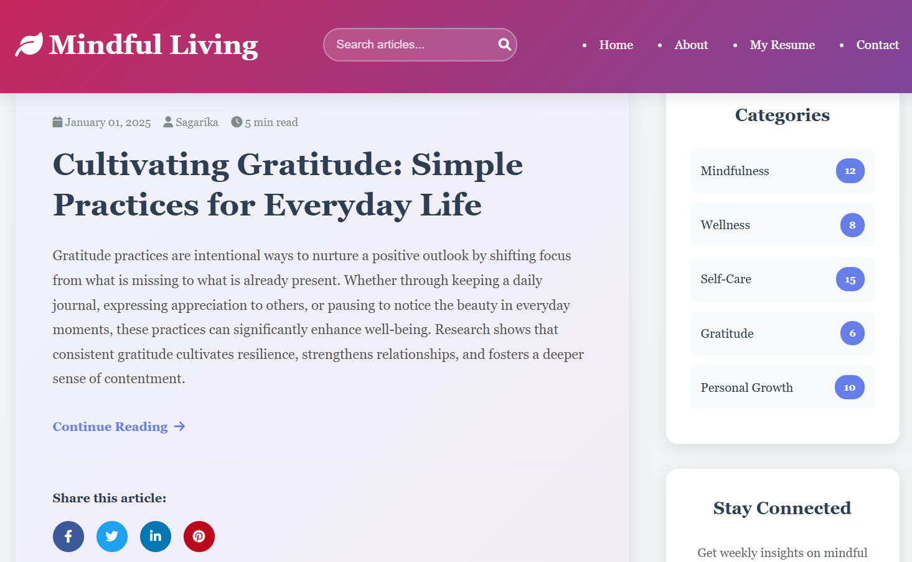
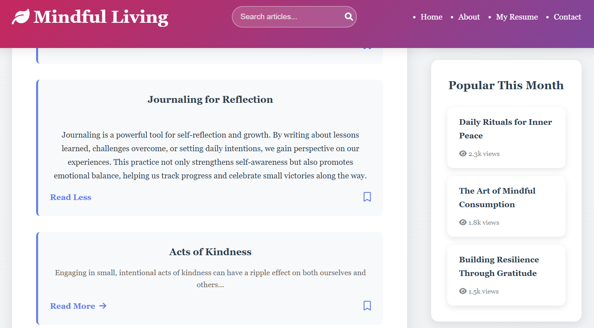
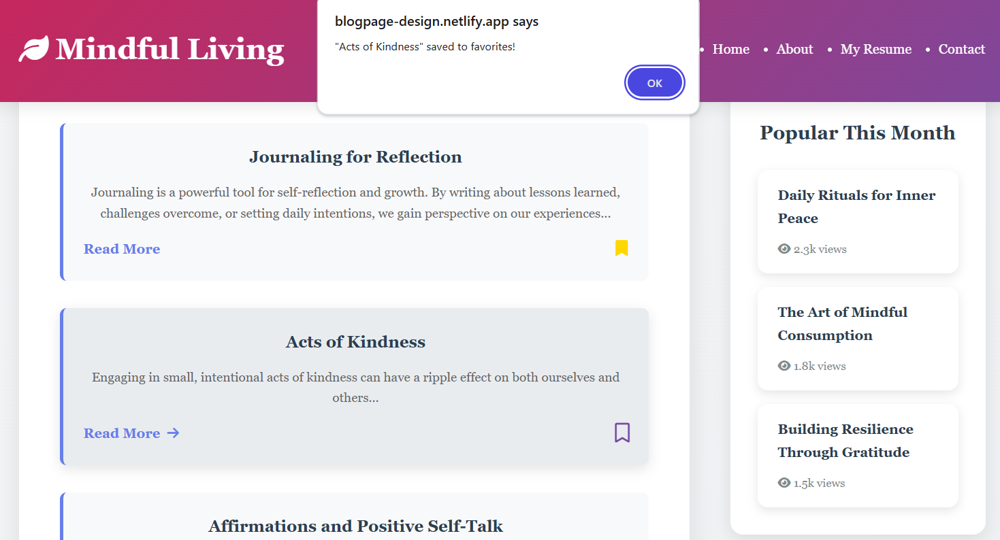
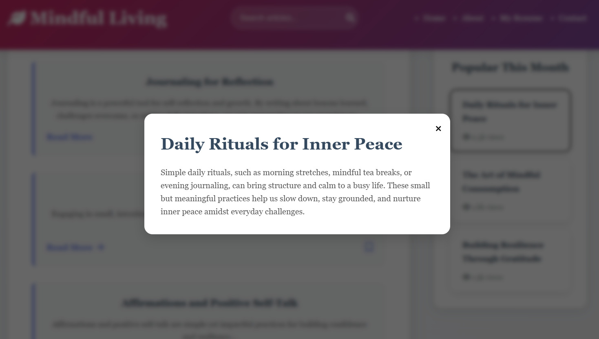

# Mindful Living Blog

## Table of Contents

*   **Description**
*   **Features**
*   **Screenshots**
*   **Technologies Used**
*   **Installation**
*   **Usage**
*   **Contributing**
*   **License**
*   **Contact**

## Description

This project is a "Mindful Living Blog" website, designed to provide articles and resources related to mindfulness, wellness, and personal growth. It features a clean, responsive design, interactive elements, and a strong focus on user experience. Beyond its primary function as a blog, this site also serves as a dynamic portfolio, strategically integrating sections that highlight my skills in Web Development, UI/UX Design, and AI/Machine Learning within the context of a functional blog application. This approach allows for a practical demonstration of my abilities in building and designing web experiences.

## Features

*   **Responsive Design**: Adapts seamlessly to various screen sizes (desktop, tablet, mobile).
*   **Blog Posts**:
    *   Featured article section.
    *   Grid display for recent articles with "Read More" toggles.
    *   Social sharing options for articles (Facebook, Twitter, LinkedIn, Pinterest).
    *   Favorite/Bookmark functionality for articles with local storage persistence.
*   **Sidebar Widgets**:
    *   Categories list with article counts.
    *   Newsletter subscription form.
    *   "Popular This Month" section with interactive modal for full article previews.
*   **Navigation**:
    *   Clear navigation bar with links to Home, About, Resume (PDF), and Contact pages.
    *   Search bar for articles.
*   **About Page**:
    *   Detailed information about Sagarika, including her professional experience and personal interests.
    *   Organized display of skills in Web Development, UI/UX & Design, AI & Machine Learning, and Tools & Platforms.
*   **Contact Page**:
    *   Contact form powered by Formspree for easy message submission.
    *   Direct email link.
    *   Thank You page upon successful form submission.
*   **Smooth Scrolling**: Enhanced user experience with smooth transitions for internal links.
*   **Animations**: Subtle scroll-triggered animations for content cards and widgets.

## Screenshots

A visual tour of the Mindful Living Blog:

*   **Homepage**
    The main landing page, showcasing the featured article and recent posts, along with the navigation and sidebar.

    

*   **Read More/Less Toggle**
    Demonstrates the functionality to expand and collapse article content for a cleaner reading experience.

    

*   **Favorites Option**
    Highlights the bookmark icon, allowing users to save articles to their local favorites.

    

*   **Popular This Month Modal**
    Shows the interactive modal that appears when a user clicks on a popular article in the sidebar, providing a quick overview.

    

## Technologies Used

*   **HTML5**: For structuring the web content.
*   **CSS3**: For styling and layout, including responsive design.
*   **JavaScript (ES6+)**: For interactive elements, form handling, local storage, and dynamic content.
*   **Font Awesome**: For icons.
*   **Formspree**: For handling contact form submissions.

## Installation

To get a local copy up and running, follow these simple steps:

1.  **Clone the repository:**
    ```bash
    git clone https://github.com/your-username/mindful-living-blog.git
    ```
2.  **Navigate to the project directory:**
    ```bash
    cd mindful-living-blog
    ```
3.  **Open the `index.html` file in your web browser.**
    You can simply double-click `index.html` or open it via your browser's file menu.

## Usage

*   **View Live**: You can access the live version of this project hosted on Netlify here:
    **[https://blogpage-design.netlify.app/]**(https://blogpage-design.netlify.app/)
*   **Browse Articles**: Navigate through the home page to read featured and recent articles. Click "Read More" to expand content.
*   **Search**: Use the search bar in the header to simulate searching for articles.
*   **Subscribe**: Enter your name and email in the newsletter form in the sidebar to subscribe.
*   **Contact**: Fill out the contact form on the "Contact Me" page to send a message.
*   **Explore About**: Visit the "About Me" page to learn more about my skills and background.
*   **View Resume**: Click the "Resume" or "My Resume" link to open my CV/ a pdf in a new tab.
*   **Favorite Articles**: Click the bookmark icon on any article card to save it to your local favorites.
*   **Popular Posts**: Click on the popular posts in the sidebar to view their full descriptions in a modal.

## Contributing

Contributions are welcome! If you have suggestions for improvements or new features, please feel free to:

1.  Fork the repository.
2.  Create a new branch (`git checkout -b feature/YourFeature`).
3.  Make your changes.
4.  Commit your changes (`git commit -m 'Add some feature'`).
5.  Push to the branch (`git push origin feature/YourFeature`).
6.  Open a Pull Request.

## License

This project is licensed under the MIT License - see the `LICENSE` file for details.

## Contact

**Sagarika**
*   **Email**: sagarikabhagat311@gmail.com
*   **LinkedIn**: [Sagarika Bhagat](https://www.linkedin.com/in/sagarika-bhagat)

---
© 2025 Mindful Living Blog. All rights reserved. Built with ❤️ by Sagarika.
